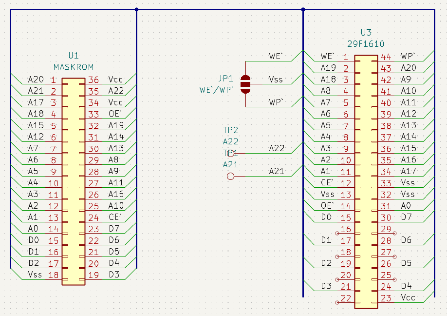

# SNES/SFC Maskrom Adapters

Adapters to replace SNES maskrom with PSOP44 Flashes.

## snes_maskrom_psop_to_dip_adapter
Backside PSOP44 to DIP36 adapter. Designed and tested for AM29F1610. Non destructive option, CE``/OE`` pins of original maskrom should be cut.

## snes_maskrom_psop_to_dip_adapter_front
Fronside PSOP44 to DIP36 adapter. Designed and tested for AM29F1610. Replaces original maskrom.
