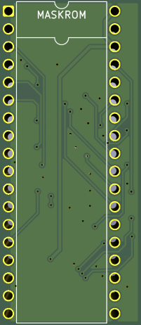
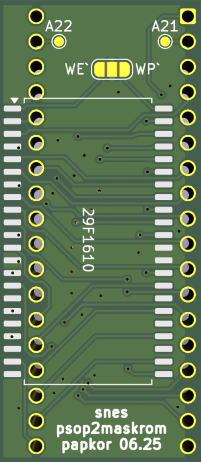
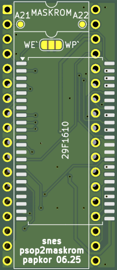

# SNES/SFC Maskrom Adapters

Adapters to replace SNES DIP32/DIP36 maskrom with PSOP44 Flash.

Maskroms: MX23C1601-12, M531610D-20, UPD23C4013 and other similar maskrom ICs.

## snes_maskrom_psop_to_dip_adapter
Backside PSOP44 to DIP36 adapter. Designed and tested for MX29F1610. Non destructive option, CE\`/OE\` pins of original maskrom should be cut.

 

## snes_maskrom_psop_to_dip_adapter_front
Fronside PSOP44 to DIP36 adapter. Designed and tested for MX29F1610. Replaces original maskrom.

 
